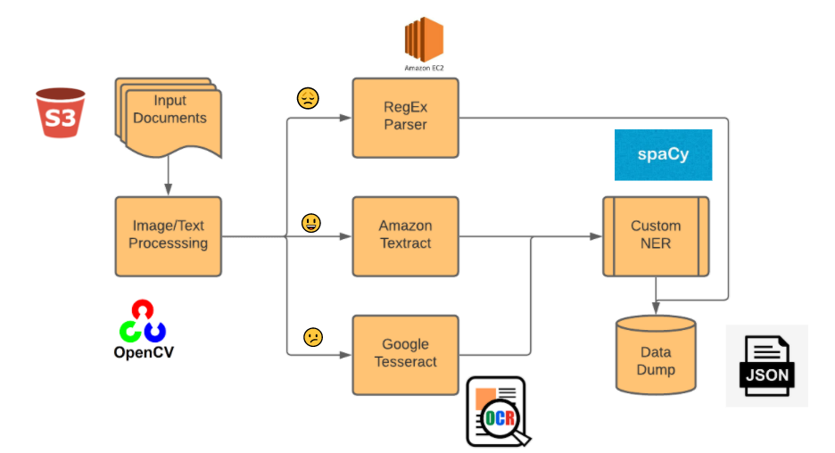
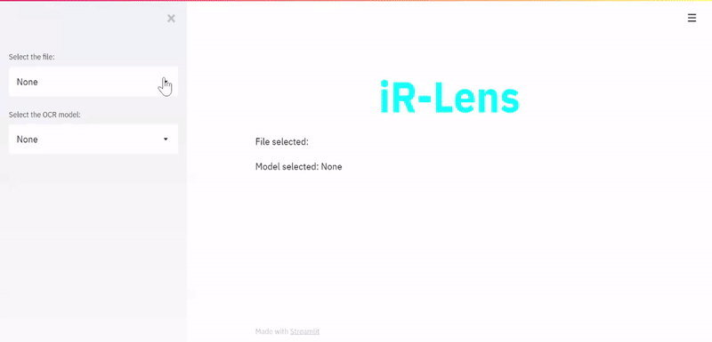
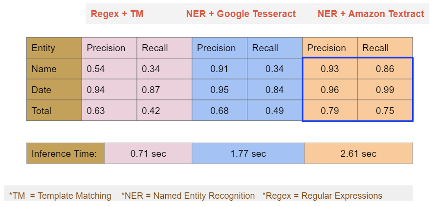
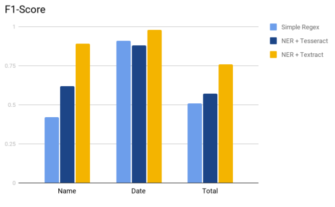
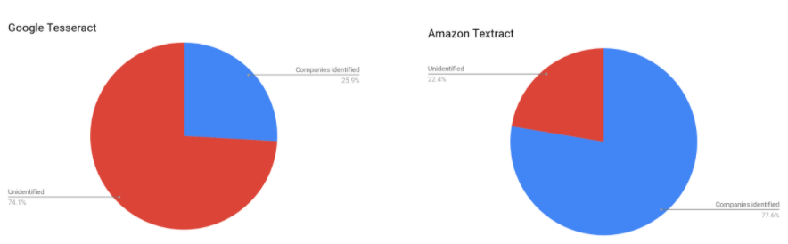

# iReceipt Lens
iR Lens is an automated Receipt/Invoice Parser which extracts predefined entities from a document into structured data(key-value pairs). This project was developed to eliminate the inefficiencies caused due to manual data entry. This project has a wide range of commercial applications as well as daily personal uses.

## Motivation for this project:
- Every year there is a $120B worldwide due to inefficiencies related to manual data entry at fulfillment centres(Eg:Third party warehouses).
- Many Enterprises in the market have huge volumes of unstructured data and it keeps growing exponentially. Eg: Law firms, Warehouses, Banks etc.
- Track your monthly expenses without having to search for your receipts in a sea of documents. 
- Document Understanding using AI is a trending technology.

## Setup
Clone repository
```
repo_name=iR-Lens # URL of the project repository
username=Ujjwalgutta # Username 
git clone https://github.com/$username/$repo_name
```
Installation
```
pip install -r requirements.txt
pip install setup.py
```

## Data Pipeline
The workflow is as follows:
 

### Training
Once the package setup is completed, model can be trained by running `train_spacy.py` script.
```
python train_spacy.py
```
After training is completed the model will be saved to the folder `models/new_model`

### Run Inference
Predefined Entities can be extracted from the documents using two Optical Character Recognition methods.\
To use 'Google Tesseract' the function `iReceipt_Lens.predict.predict_tesseract` should be called.\
To use 'Amazon Textract' the function `iReceipt_Lens.predict.predict_textract` should be called.

## Demo


## Results
List of Precision and Recall Values for different methods implemented.\
'Amazon Textract + Named Entity Recognition' method outperformed the remaining methods by a noticable margin.\



## Analysis
Comparative Analysis of F1-Score across all the models.


Company Names identified using different OCR models.

